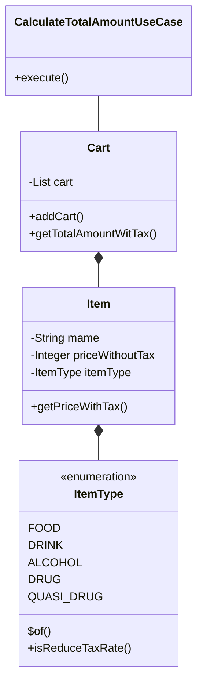

# 共有会 2023/11/27
## 問題
### 軽減税率対応
とあるドラッグストアのレジシステムを作成することになった。2019 年 10 月 1 日以降のシステムのため、軽減税率に対応する必要がある。このドラッグストアで扱う商品と、軽減税率適応かどうかは以下の表の通りである。

| 商品種別  | 軽減税率 |
|:------|:-----|
| 食料品   | 対象   |
| 飲料品   | 対象   |
| 酒類    | 対象外  |
| 医薬品   | 対象外  |
| 医薬部外品 | 対象外  |

買い物の合計金額を出力する機能を実装せよ。ただし、設計の方針を説明してから TDD で実装せよ。
税込金額は商品 1 つずつ計算し、端数は切り捨てとする。
受け入れ条件は以下の通りである。
- ケース 1 
  - 以下の商品を購入した時、税込の合計金額は 765 円。 
    - 税抜 139 円の鮭おにぎりを 2 つ 
    - 税抜 141 円の氷結を 3 本
- ケース2 
  - 以下の商品を購入した時、税込の合計金額は 2162 円。
    - 税抜 186 円の大きなおむすびを 3 つ 
    - 税抜 140 円の午後の紅茶を 4 本 
    - 税抜 871 円の新ルルＡ錠ｓ50 錠を 1 瓶
- GUI や CLI は不要で、整数を返すメソッドの作成のみでよい。

## 回答
### クラス設計

